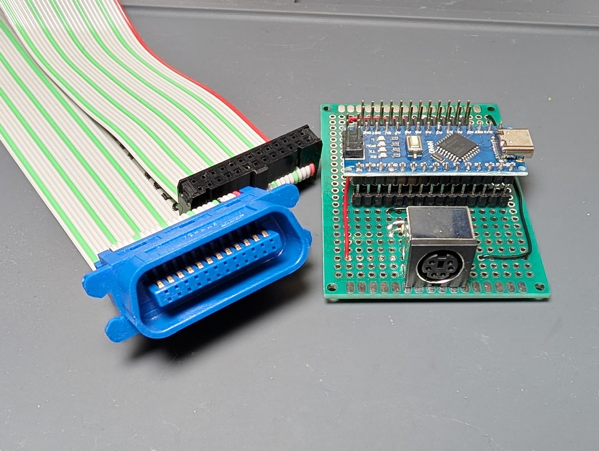
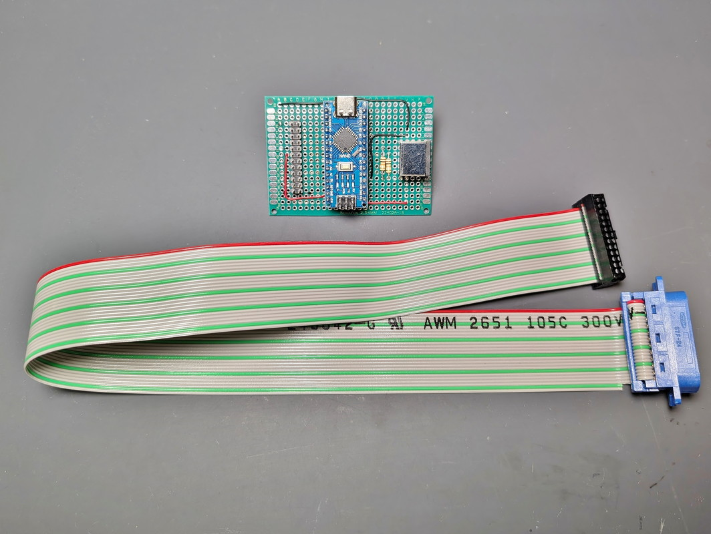
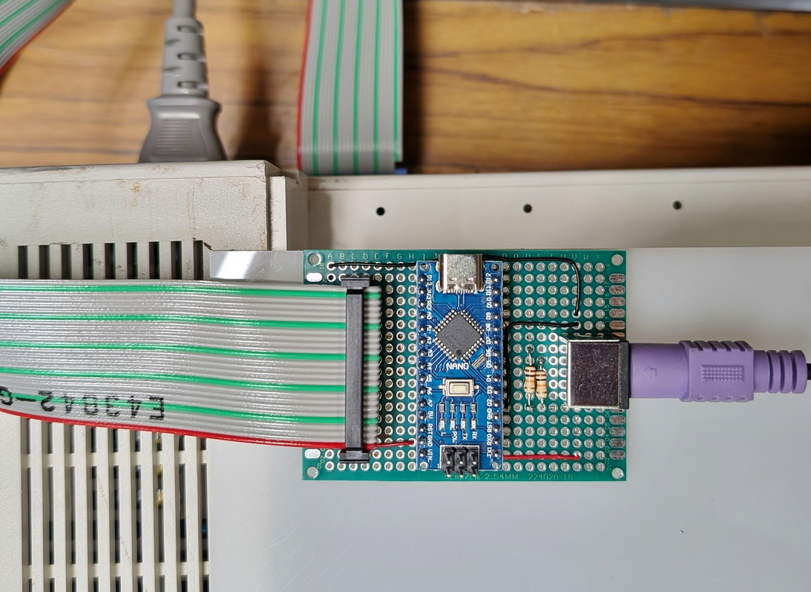

## はじめに
このプロジェクトは、[yoichiro-ono氏](https://github.com/yoichiro-ono/FM77-KBIF) によって開発された FM77-KBIF を Arduino Nano にインポートする試みです。

## これは何か
Arduino Nano を使った FM77 に PS/2 キーボードを接続するためのI/F回路と変換コードです。
回路はFM77側とPS/2側のI/OをNanoが担う単純なものです。
FM77側は24ピンアンフェノールオスコネクタが必要です。回路図内のJ1からフラットケーブルで作成してください。

## オリジナル
FM77-KBIF のオリジナルプロジェクトについては、下記を参照してください。

* [FM-77用PS/2キーボードインターフェース](https://ono416.hatenablog.com/entry/2020/07/26/114106) ono416氏
* [FM77-KBIF GitHub](https://github.com/yoichiro-ono/FM77-KBIF)

## このプロジェクト
このプロジェクトはオリジナルプロジェクトの回路を Arduino Nano に置き換え、動作するようにコードに修正を加えたものです。
機能は全てオリジナルに準じます。
PCBデータはありません。

## アップデート
2025-03-27 最初のコミット

## ライセンス
オリジナルライセンスに基づきます。
ただしオリジナルライセンスは明示されていません。
あくまでもポーティングの一例として参照してください。
著作的に問題があれば対応しますのでお知らせください。

